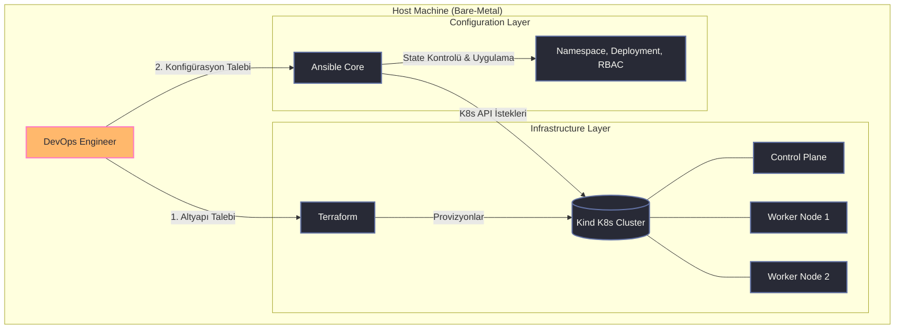

# Local Kubernetes Infrastructure & Configuration Management (PoC)

Bu proje, yerel bir ortamda (Localhost) Kubernetes cluster altyapısının kod olarak (IaC) ayağa kaldırılmasını ve üzerindeki servislerin yapılandırma yönetimi (Configuration Management) prensipleriyle yönetilmesini sağlayan bir DevOps konsept kanıtıdır (PoC).

Projede altyapı provizyonu, Kubernetes kaynak yönetimi ve manifestolar düzenli bir monorepo hiyerarşisi içerisinde tutulmaktadır. Amaç, imperatif (emredici) manuel müdahaleleri ve bash betiklerini tamamen terk ederek, donanım üzerinde saniyeler içinde "Production-Ready" standartlarında deklaratif bir test laboratuvarı oluşturmaktır.

## 🏗️ Mimari ve İş Akışı

Sistem, altyapının sıfırdan var edilmesi ve konfigürasyonların uygulanması olmak üzere iki ana katmandan oluşmaktadır. Imperatif script'ler yerine tam idempotent (tekrarlanabilir) bir otomasyon akışı benimsenmiştir.



## 🧠 Teknoloji Kararları ve Yaklaşımlar

* **Terraform ile Altyapı Yönetimi (IaC):** Kubernetes cluster'ını manuel kurmak yerine `tehcyx/kind` provider'ı kullanılmıştır. Bu yaklaşım, cluster mimarisinin (1 Control Plane, 2 Worker Node vb.) bir 'state' dosyası üzerinden izlenmesini ve ihtiyaç anında tüm altyapının sistem kaynaklarından temiz bir şekilde silinmesini (`destroy`) sağlar.
* **Ansible ile Deklaratif Otomasyon:** `kubectl apply` komutlarını körlemesine çalıştıran legacy bash script'leri (`deploy.sh`) yerine, K8s kaynaklarının yönetimi için Ansible'ın idempotent yapısına geçilmiştir. Böylece sistemde sadece istenen durumdan (desired state) sapmalar olduğunda değişiklik yapılır, API yorulmaz ve hata yönetimi kusursuzlaştırılır.
* **Modüler Manifest Yapısı:** İleri düzey K8s objeleri (RBAC, Ingress, StatefulSet, Probes vb.) ayrıştırılmış bir klasör mimarisinde (`yaml/`) tutularak sistemin okunabilirliği maksimum seviyeye çıkarılmıştır. Bu dosyalar zamanla Ansible playbook'larına entegre edilebilecek referans niteliği taşır.

## 📂 Klasör Yapısı ve Modüller

Proje, sorumlulukların net bir şekilde ayrıldığı şu hiyerarşiyi kullanır:

```text
k8s-cluster/
├── infrastructure/
│   ├── ansible/
│   │   └── k8s-kurulum.yml    # Ansible ile temel K8s objelerinin deklaratif kurulumu
│   └── terraform/
│       ├── main.tf            # Cluster donanım/node mimarisinin Terraform tanımı
│       └── terraform.tfstate  # Altyapının mevcut durumunu tutan lokal state dosyası
├── yaml/                      # Detaylı Kubernetes manifestoları (Legacy/Referans)
│   ├── 01-namespaces.yaml
│   ├── 02-rbac.yaml           # Rol ve yetkilendirme (Role-Based Access Control)
│   ├── 03-config.yaml         # ConfigMap ve Secret tanımları
│   ├── 04-deployments.yaml
│   ├── 05-ingress.yaml        # Dış dünya trafik yönlendirmesi
│   ├── 06-probes-lb.yaml      # Health-check (Liveness/Readiness) ve LoadBalancer
│   ├── 07-daemonset.yaml      # Her node'da çalışması gereken servisler
│   ├── 08-statefulset.yaml    # Kalıcı veri gerektiren (Stateful) uygulamalar
│   └── 09-service-account.yaml
└── README.md
```

## 🚀 Dağıtım (Deployment) Süreçleri

Sistemin kurulumu, otomasyon araçlarının sırayla tetiklenmesi mantığına dayanır.

**1. Altyapının Ayağa Kaldırılması:**
İlk aşamada Terraform ile donanım provizyonu sağlanır. Bu işlem, Docker üzerinde sanal node'ları oluşturur ve Kubernetes API'sini hazır hale getirir.
* *Çalışma Dizini:* `infrastructure/terraform`
* *Süreç:* Başlatma (`terraform init`) ve uygulama (`terraform apply -auto-approve`).

**2. Konfigürasyonların Uygulanması:**
Cluster hazır olduktan sonra, Ansible devreye girerek K8s objelerini ve uygulamaları cluster içerisine enjekte eder. Ansible'ın yapısı gereği bu işlem defalarca güvenle tekrarlanabilir.
* *Çalışma Dizini:* `infrastructure/ansible`
* *Süreç:* Playbook'un çalıştırılması (`ansible-playbook k8s-kurulum.yml`).

## 🧹 Kaynak Yönetimi ve Temizlik

Test senaryoları tamamlandığında, host makinenin sistem kaynaklarını (RAM/CPU) tamamen serbest bırakmak için Terraform'un yok etme özelliği kullanılır. Bu işlem K8s node'larını ardında zombi process bırakmadan imha eder:
```bash
cd infrastructure/terraform
terraform destroy -auto-approve
```
