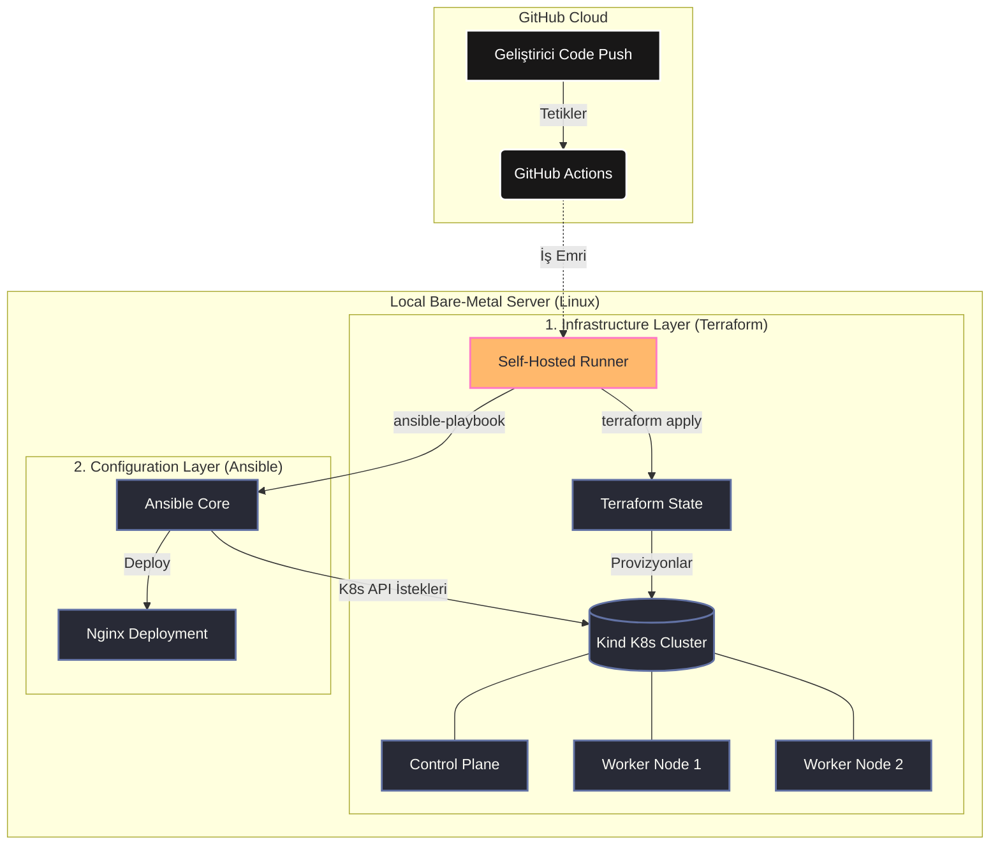

# Local Kubernetes GitOps Monorepo

Bu proje, yerel bir ortamda (Localhost) tam kapsamlı bir DevOps ve Platform Mühendisliği altyapısının "Infrastructure as Code" (IaC) ve "Configuration Management" prensipleriyle nasıl inşa edileceğini gösteren bir konsept kanıtıdır (PoC).

Altyapı provizyonu, Kubernetes konfigürasyon yönetimi ve CI/CD süreçleri tek bir monorepo üzerinden yönetilmektedir. Amaç, manuel müdahaleleri sıfıra indirerek donanım üzerinde saniyeler içinde ayağa kalkabilen, "Production-Ready" standartlarında bir test laboratuvarı oluşturmaktır.

## 🏗️ Mimari ve İş Akışı (Architecture)

Aşağıdaki diyagram, kodun repository'ye gönderilmesinden uygulamanın cluster üzerinde ayağa kalkmasına kadar olan tam otomatik CI/CD sürecini göstermektedir:



## 🧠 Teknoloji Kararları ve Yaklaşımlar (Architecture Decisions)

Bu projede kullanılan teknolojiler rastgele seçilmemiş, modern DevOps prensiplerine (Declarative & Idempotent) sadık kalınarak tasarlanmıştır.

* **Terraform ile Altyapı Yönetimi (IaC):** Kubernetes cluster'ını manuel komutlarla kurmak yerine Terraform kullanılmıştır. Altyapının durumu kontrol altında tutulur ve ihtiyaç kalmadığında `terraform destroy` komutu ile geride hiçbir zombi process bırakmadan kaynaklar tamamen temizlenir.
* **Ansible ile K8s Konfigürasyon Yönetimi:** Manifest dosyalarını manuel uygulamak yerine, Ansible'ın "Idempotent" (tekrarlanabilir) doğasından faydalanılmıştır. Playbook defalarca çalıştırılsa bile, cluster'da bir değişiklik yoksa sistem yorulmaz, sadece farklılıklar düzeltilir.
* **GitHub Actions (Self-Hosted Runner):** GitHub bulut sunucularının yerel ağımıza dışarıdan erişimi olmadığı için, Runner doğrudan yerel makinede çalıştırılmış ve güvenli bir GitOps köprüsü kurulmuştur.

## 📂 Klasör Yapısı (Monorepo)

Proje, konfigürasyon ve altyapı kodlarının ayrıştırıldığı düzenli bir Monorepo yapısındadır:

```text
k8s-cluster/
├── .github/
│   └── workflows/
│       └── ci-cd.yml          # GitHub Actions pipeline tanımı
├── infrastructure/
│   ├── ansible/
│   │   └── k8s-kurulum.yml    # Namespace, Deployment vb. K8s kaynakları
│   └── terraform/
│       ├── main.tf            # Cluster mimarisi ve node tanımları
│       └── .gitignore         # State ve hassas verilerin izolasyonu
├── k8s-manifests/             # Legacy manuel referans YAML dosyaları
└── README.md
```

## 🚀 Kurulum ve Çalıştırma

### Ön Koşullar
* Docker Daemon
* Terraform (v1.0+)
* Ansible & `python-kubernetes`
* Kind (Kubernetes in Docker)
* GitHub Actions Self-Hosted Runner 

### 1. Altyapıyı Başlatma (Provisioning)
```bash
cd infrastructure/terraform
terraform init
terraform apply -auto-approve
```

### 2. Sürekli Dağıtım (CI/CD Pipeline)
Repository'nin `main` branch'ine yapılan her Git Push işlemi pipeline'ı otomatik tetikler. Manuel tetikleme için:
```bash
cd infrastructure/ansible
ansible-playbook k8s-kurulum.yml
```

### 3. Kaynakların Temizlenmesi (Tear Down)
Çalışma bittiğinde sistem kaynaklarını (RAM/CPU) tamamen boşa çıkarmak için:
```bash
cd infrastructure/terraform
terraform destroy -auto-approve
```
